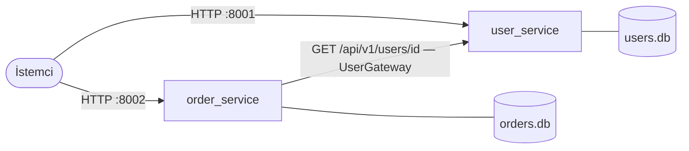
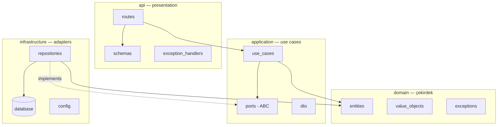

# Sistem Mimarisi

## Servisler

- Her servisin **kendi veritabanı** vardır (database-per-service). Bir servis diğerinin
  tablosuna asla doğrudan bakmaz; veriye yalnızca sahibinin API'si üzerinden erişilir.
  Gerekçe: [ADR-0002](adr/0002-database-per-service.md).
- `order_service`, sipariş oluştururken kullanıcının varlığını `user_service`'e sorar.
  Bu çağrı bile doğrudan yapılmaz: use case yalnızca `UserGateway` arayüzünü bilir,
  httpx implementasyonu `infrastructure/gateways/` içindedir.

## Bir servisin iç mimarisi

Ok yönleri = import yönleri. `domain` hiçbir kutuya ok çıkarmaz; `infrastructure`
`application`'daki port'ları implemente eder (kesikli ok) ama use case'ler onu tanımaz.

## Bağlama noktası: composition root

Arayüz ile implementasyonu birbirine bağlayan tek yer `container.py` + FastAPI'nin
`Depends` mekanizmasıdır (`api/dependencies.py`). Uygulamanın geri kalanı somut
sınıf adlarını bilmez. SQLite'ı PostgreSQL ile, httpx'i gRPC ile değiştirmek yalnızca
bu bağlama noktasına ve `infrastructure/`'a dokunur.

## Teknoloji seçimleri

| Konu        | Seçim                       | Not                                            |
| ----------- | --------------------------- | ---------------------------------------------- |
| Web         | FastAPI + Uvicorn           | Async, otomatik OpenAPI                        |
| Doğrulama   | Pydantic v2                 | Yalnızca api ve config katmanında              |
| ORM         | SQLAlchemy 2.0 (async)      | Yalnızca infrastructure katmanında             |
| DB          | SQLite (varsayılan)         | Eğitimde kurulumsuz çalışsın diye; bkz. aşağı  |
| HTTP client | httpx (async)               | Yalnızca order_service gateway adapter'ında    |
| Test        | pytest + pytest-asyncio     | unit: fake'lerle; integration: ASGI transport  |
| Kalite      | ruff + mypy (strict)        | `make lint`                                    |

### PostgreSQL'e geçiş

Mimarinin iddiasını test etmenin iyi bir yolu: `DATABASE_URL`'i
`postgresql+asyncpg://...` yapın, `asyncpg` paketini ekleyin. `domain/`, `application/`
ve `api/` katmanlarında **tek satır** değişmemesi gerekir.
